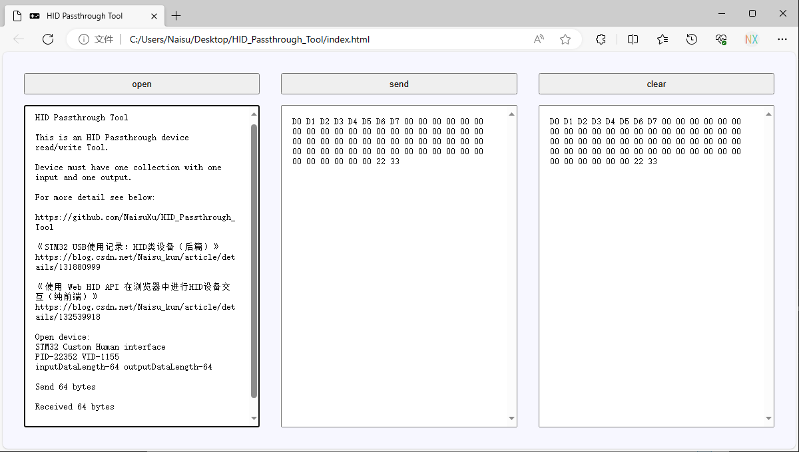

# HID Passthrough Tool

## Brief

This is an HID Passthrough device read/write Tool.

Device must have one collection with one input and one output.

For more detail see below:

[https://github.com/NaisuXu/HID_Passthrough_Tool](https://github.com/NaisuXu/HID_Passthrough_Tool)

[《STM32 USB使用记录：HID类设备（后篇）》](https://blog.csdn.net/Naisu_kun/article/details/131880999)

[《使用 Web HID API 在浏览器中进行HID设备交互（纯前端）》](https://blog.csdn.net/Naisu_kun/article/details/132539918)

## Usage

Double click open the `index.html` file in browser, and open a device for send / receive data.

Note: WebHID API is an experimental technology, just new Chrome/Edge/Opera browser support it now.

## Screenshot

## License

This project is under the `MIT licence` , see the `LICENSE` file.

